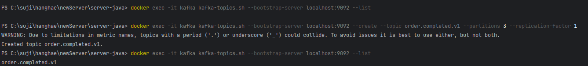
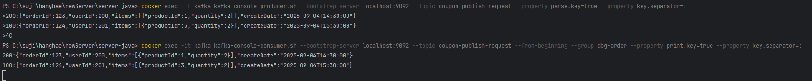
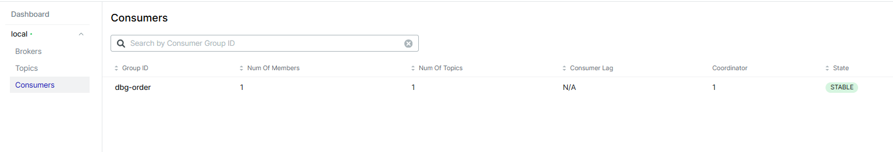

---
### Kafka 기초


* #### 개념

  대용량 데이터를 빠르게 처리하고, 실시간 스트리밍을 지원하는 분산 메시지 시스템.
* #### 구성 요소

    - Producer : 메시지를 보내는 주체
    - Consumer : 메시지를 구독해서 가져가는 주체
    - Broker : Kafka 서버, 메시지를 저장하고 전달하는 역할
    - Topic : 메시지가 모이는 곳
    - Partition : Topic을 여러 조각으로 나눔 → 병렬처리, 확장성
    - Offset : Partition안에서의 메시지의 번호 → 읽은 위치를 기억
    - Consumer Group : Consumer묶음. Partition을 나눠 처리
    - Rebalancing : Consumer Group 안에서 Consumer 수 또는 Partition 수 변경 시, 다시 할당 처리
      → 처리하는  동안 메시지 소비 정지 가능성 有. 최소화 전략 세우기.
    - Cluster : 여러 개의 Kafka Broker가 모여 하나의 Kafka 시스템이 됨 → 확장, 안정성 확보
    - Replication : 같은 Partition 데이터를 여러 Broker에 복사
      → Broker 장애시 데이터 유지 가능

----

* #### Kafka 동작 흐름
  사용되는 흐름은 간단하다.
   ```
  Producer → Topic → Broker → Consumer Group
  ```
    1. Producer 가 메시지를 Topic에 보냄
    2. Broker가 메시지를 Partition에 저장
    3. Consumer Group이 Topic을 구독해서 메시지를 가져감
    4. Offset으로 어디까지 읽었는지 기록 → 장애나 재시작 시 이어서 처리 가능

----

* #### Kafka 메시지 소비 원리

1. **[순서 보장 (Producer → Partition)]**
   한 Partition 안에는 메시지가 Append-Only Log 구조로 기록.
    * Producer가 보낸 메시지는 파일 끝에 순서대로 추가해 물리적 순서 보장
    * 같은 Partition에서 순서 보장

2. **[소비위치 기록 (Offset)]**
   Partition 안의 각 메시지에는 고유 번호인 Offset이 존재.
    * Consumer가 메시지를 읽으면 어디까지 읽었는지를 Offset으로 표시. (__consumer_offsets 내부 토픽에 저장)

3. **[독립 소비(Consumer Group)]**
   Consumer Group별로 Offset을 따로 관리하기 때문에 같은 메시지를 읽어도 offset이 다름.
    * 손실/간섭없이 독립적 소비 가능

----

* #### Kafka 주의 사항

1. 순서 보장은 Partition 단위
   같은 Partition 안에서는 순서 보장하지만, Partition이 여러 개면 전체 순서는 깨짐.
   e.x) 주문 이벤트는 Key를 orderId선정. 같은 주문은 반드시 같은 Partition에 들어가도록 함.

2. 메시지 중복 가능성
   Producer가 네트워크 오류 시 재시도하면서 메시지가 중복 기록될 수 있음.
   Consumer도 같은 메시지를 다시 읽을 수 있음.

   따라서 애플리케이션은 idempotent(중복처리 방지) 로직을 반드시 가져야 함.
   예: DB에서 orderId가 이미 있으면 무시.

3. 메시지 유실 가능성
   Consumer가 메시지를 가져와서 처리하다가 죽으면, Commit 안 된 Offset 이후 메시지는 다시 읽힘 → 중복 발생.
   반대로 Offset만 먼저 Commit하면 → 처리 실패했는데 Kafka는 읽은 걸로 처리 → 메시지 유실.
   해결: “처리 후 Commit” 원칙 사용 (또는 Transactional Producer/Consumer).

4. Rebalancing 비용
   Consumer Group에 Consumer가 추가되거나 죽으면 Rebalancing 발생.
   이 시간 동안 메시지 소비가 멈춤.
   실무에서는 static membership 같은 기능으로 Rebalance 최소화 전략 씀.

5. Retention 정책
   Kafka는 메시지를 영원히 저장하지 않음.
   시간 기준(예: 7일), 용량 기준(예: 1GB) 중 하나로 메시지가 삭제됨.
   데이터 분석용이라면 Retention 기간을 충분히 늘리거나, HDFS/DB 같은 다른 스토리지로 옮겨야 함.

6. Consumer Lag (지연)
   Consumer가 제때 메시지를 못 읽으면 **Lag(쌓여있는 메시지)**가 생김.
   Lag이 커지면 실시간성이 깨지므로, 모니터링 필수.


---

### 로컬에서 Kafka 사용하기

* #### 도커 연결 법

1. docker-compose.yml 에 카프카 관련 설정 작성
    * 현재 Zookeeper 는 KRaft에 의해 자체적으로 메타데이터를 관리하므로 별도 설치할 필요 없음.
    ```
       kafka:
       image: bitnami/kafka:4.0.0-debian-12-r7
       container_name: kafka
       ports:
        - "9092:9092"
          environment:
        - KAFKA_ENABLE_KRAFT=yes
        - KAFKA_CFG_NODE_ID=1
        - KAFKA_CFG_PROCESS_ROLES=broker,controller
        - KAFKA_CFG_CONTROLLER_QUORUM_VOTERS=1@kafka:9093
    
        - KAFKA_CFG_LISTENERS=PLAINTEXT://:9092,CONTROLLER://:9093,PLAINTEXT_HOST://:29092
        - KAFKA_CFG_ADVERTISED_LISTENERS=PLAINTEXT://kafka:9092,PLAINTEXT_HOST://localhost:29092
        - KAFKA_CFG_LISTENER_SECURITY_PROTOCOL_MAP=PLAINTEXT:PLAINTEXT,CONTROLLER:PLAINTEXT,PLAINTEXT_HOST:PLAINTEXT
        - KAFKA_CFG_CONTROLLER_LISTENER_NAMES=CONTROLLER
        
        kafka-ui:
        image: provectuslabs/kafka-ui:master
        container_name: kafka-ui
        depends_on:
        - kafka
        ports:
          - "8085:8080"
          environment:
                - DYNAMIC_CONFIG_ENABLED=true
                - KAFKA_CLUSTERS_0_NAME=local
                - KAFKA_CLUSTERS_0_BOOTSTRAPSERVERS=kafka:9092
    ```

2. terminal > docker compose up -d 명령어 입력 (도커에 카프카 관련 이미지 올리기)
3. kafka-ui로 연결 확인하기 위해 localhost:8085 (본인이 설정한 포트로 연결)로 접속
4. 카프카 관련 gradle 추가

        //카프카
        // https://mvnrepository.com/artifact/org.springframework.kafka/spring-kafka
        implementation("org.springframework.kafka:spring-kafka:3.3.4")
        // https://mvnrepository.com/artifact/org.apache.kafka/kafka-clients
        implementation("org.apache.kafka:kafka-clients:3.9.1")


5. 카프카 관련 application.yml 추가

       kafka:
       bootstrap-servers: localhost:9092
       producer:
       acks: all # 메시지 브로커 저장 확인 수준
       retries: 3 #메시지 전송 실패 시 자동 재시도 횟수
       key-serializer: org.apache.kafka.common.serialization.StringSerializer #프로듀서가 보낼 데이터를 바이트 배열로 직렬화
       value-serializer: org.apache.kafka.common.serialization.StringSerializer 
       properties:
       enable.idempotence: true #중복 전송 방지
       max.in.flight.requests.per.connection: 5
       consumer:
       group-id: ecommerce-group # 같은 그룹의 여러 컨슈머 -> 파티션을 나눠 메시지 읽음
       auto-offset-reset: earliest # 초기 컨슈머 그룹 생성 후 오프셋 기록 미존재 시 읽을 곳 결정 (맨 앞)
       key-deserializer: org.apache.kafka.common.serialization.StringDeserializer # 바이트 배열 -> 객체로 역직렬화 
       value-deserializer: org.apache.kafka.common.serialization.StringDeserializer #UTF-8 -> Java 문자열로 변환

   #### _위 내용 적용 후 Application 실행 시 문제 없으면 설정 완료_
---


* #### Topic 발급 with CLI

    ```
      docker exec -it kafka kafka-topics.sh --bootstrap-server localhost:9092 --list  
      docker exec -it kafka kafka-topics.sh --bootstrap-server localhost:9092 --create --topic order.completed.v1 --partitions 3 --replication-factor 1

    ```
* #### Topic 발행

    ```
    docker exec -it kafka kafka-console-producer.sh --bootstrap-server localhost:9092 --topic coupon-publish-request --property parse.key=true --property key.separator=:
      >200:{"orderId":123,"userId":200,"items":[{"productId":1,"quantity":2}],"createDate":"2025-09-04T14:30:00"}
      >100:{"orderId":124,"userId":201,"items":[{"productId":3,"quantity":2}],"createDate":"2025-09-04T15:30:00"}

  ```

* #### Topic 소비

    ```
    docker exec -it kafka kafka-console-consumer.sh --bootstrap-server localhost:9092 --topic coupon-publish-request --from-beginning --group dbg-order --property print.key=true --property key.separator=:
  ```

* _실제 cli 실행_

    

    

    
---

