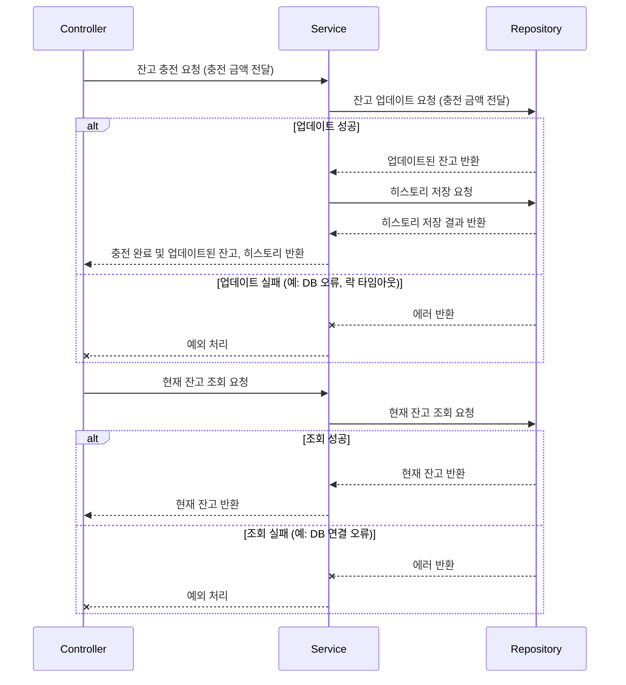

```mermaid
sequenceDiagram
    participant Controller
    participant Service
    participant Repository

    Controller->>Service: 잔고 충전 요청 (충전 금액 전달)

    Service->>Repository: 잔고 업데이트 요청 (충전 금액 전달)

    alt 업데이트 성공
        Repository-->>Service: 업데이트된 잔고 반환
        Service->>Repository: 히스토리 저장 요청
        Repository-->>Service: 히스토리 저장 결과 반환
        Service-->>Controller: 충전 완료 및 업데이트된 잔고, 히스토리 반환
    else 업데이트 실패 (예: DB 오류, 락 타임아웃)
        Repository--xService: 에러 반환 
        Service--xController: 예외 처리
    end

    Controller->>Service: 현재 잔고 조회 요청
    Service->>Repository: 현재 잔고 조회 요청
    alt 조회 성공
        Repository-->>Service: 현재 잔고 반환
        Service-->>Controller: 현재 잔고 반환
    else 조회 실패 (예:  DB 연결 오류)
        Repository--xService: 에러 반환 
        Service--xController: 예외 처리
    end
```