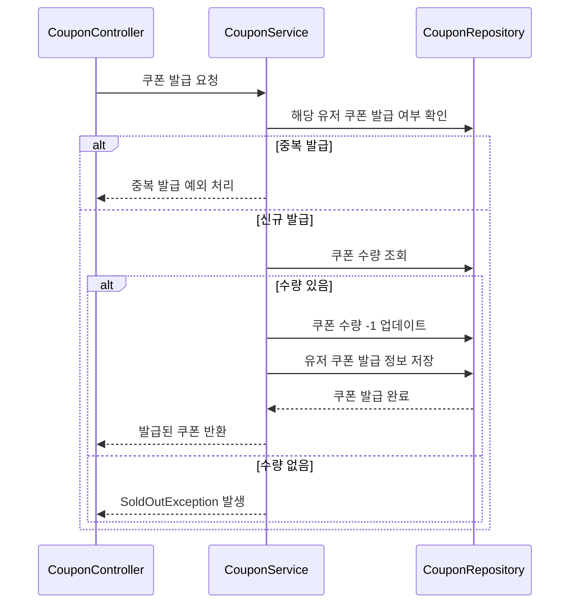

```mermaid
sequenceDiagram

    participant Controller as CouponController
    participant Service as CouponService
    participant Repo as CouponRepository

    Controller->>Service: 쿠폰 발급 요청
    Service->>Repo: 해당 유저 쿠폰 발급 여부 확인

    alt 중복 발급
        Service-->>Controller: 중복 발급 예외 처리
    
    else 신규 발급
        Service->>Repo: 쿠폰 수량 조회
        alt 수량 있음
            Service->>Repo: 쿠폰 수량 -1 업데이트
            Service->>Repo: 유저 쿠폰 발급 정보 저장
            Repo-->>Service: 쿠폰 발급 완료
            Service-->>Controller: 발급된 쿠폰 반환
        else 수량 없음
            Service-->>Controller: SoldOutException 발생
        end
    end
```