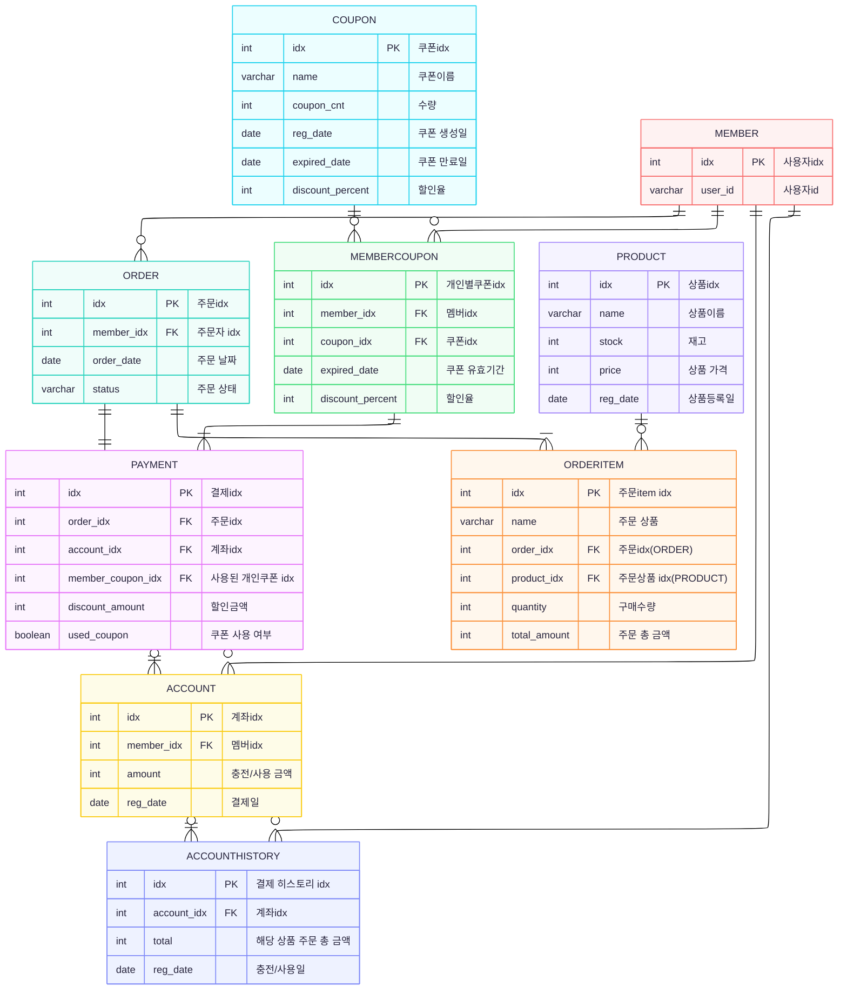

```mermaid
---
config:
  theme: redux-color
  layout: elk
  look: classic
---
erDiagram
direction TB
PAYMENT {
int idx PK "결제idx"
int order_idx FK "주문idx"
int account_idx FK "계좌idx"
int member_coupon_idx FK "사용된 개인쿠폰 idx"
int discount_amount "할인금액"
boolean used_coupon "쿠폰 사용 여부"
}
ORDER {
int idx PK "주문idx"
int member_idx FK "주문자 idx"
date order_date "주문 날짜"
varchar status "주문 상태"
}
ORDERITEM {
int idx PK "주문item idx"
varchar name "주문 상품"
int order_idx FK "주문idx(ORDER)"
int product_idx FK "주문상품 idx(PRODUCT)"
int quantity "구매수량"
int total_amount "주문 총 금액"
}
COUPON {
int idx PK "쿠폰idx"
varchar name "쿠폰이름"
int coupon_cnt "수량"
date reg_date "쿠폰 생성일"
date expired_date "쿠폰 만료일"
int discount_percent "할인율"
}
MEMBERCOUPON {
int idx PK "개인별쿠폰idx"
int member_idx FK "멤버idx"
int coupon_idx FK "쿠폰idx"
date expired_date "쿠폰 유효기간"
int discount_percent "할인율"
}
PRODUCT {
int idx PK "상품idx"
varchar name "상품이름"
int stock "재고"
int price "상품 가격"
date reg_date "상품등록일"
}
MEMBER {
int idx PK "사용자idx"
varchar user_id "사용자id"
}
ACCOUNT {
int idx PK "계좌idx"
int member_idx FK "멤버idx"
int amount "충전/사용 금액"
date reg_date "결제일"
}
ACCOUNTHISTORY {
int idx PK "결제 히스토리 idx"
int account_idx FK "계좌idx"
int total "해당 상품 주문 총 금액"
date reg_date "충전/사용일"
}
ACCOUNT ||--o{ ACCOUNTHISTORY : ""
COUPON ||--o{ MEMBERCOUPON : ""
ORDER ||--|{ ORDERITEM : ""
MEMBER ||--o{ ORDER : ""
MEMBER ||--o{ MEMBERCOUPON : ""
MEMBER ||--o{ ACCOUNT : ""
MEMBER ||--o{ ACCOUNTHISTORY : ""
MEMBERCOUPON ||--|{ PAYMENT : ""
ORDER ||--|| PAYMENT : ""
PRODUCT ||--o{ ORDERITEM : ""
PAYMENT ||--o{ ACCOUNT : ""
```

