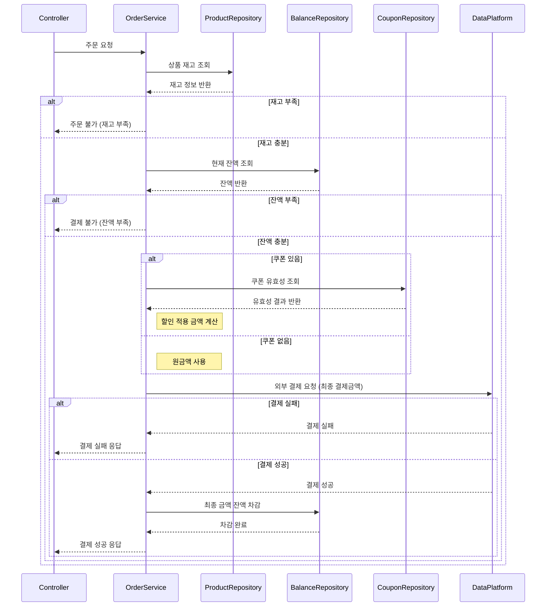

```mermaid
sequenceDiagram
    participant Controller
    participant OrderService
    participant ProductRepository
    participant BalanceRepository
    participant CouponRepository
    participant DataPlatform

    Controller->>OrderService: 주문 요청

    %% 1. 재고 확인
    OrderService->>ProductRepository: 상품 재고 조회
    ProductRepository-->>OrderService: 재고 정보 반환

    alt 재고 부족
        OrderService-->>Controller: 주문 불가 (재고 부족)
    else 재고 충분
        %% 2. 잔액 확인
        OrderService->>BalanceRepository: 현재 잔액 조회
        BalanceRepository-->>OrderService: 잔액 반환

        alt 잔액 부족
            OrderService-->>Controller: 결제 불가 (잔액 부족)
        else 잔액 충분
            %% 3. 쿠폰 유효성 확인
            alt 쿠폰 있음
                OrderService->>CouponRepository: 쿠폰 유효성 조회
                CouponRepository-->>OrderService: 유효성 결과 반환
                Note right of OrderService: 할인 적용 금액 계산
            else 쿠폰 없음
                Note right of OrderService: 원금액 사용
            end

            %% 4. 외부 결제 시도 (확정 금액 기준)
            OrderService->>DataPlatform: 외부 결제 요청 (최종 결제금액)
            alt 결제 실패
                DataPlatform-->>OrderService: 결제 실패
                OrderService-->>Controller: 결제 실패 응답
            else 결제 성공
                DataPlatform-->>OrderService: 결제 성공

                %% 5. 잔액 차감
                OrderService->>BalanceRepository: 최종 금액 잔액 차감
                BalanceRepository-->>OrderService: 차감 완료

                OrderService-->>Controller: 결제 성공 응답
            end
        end
    end
```