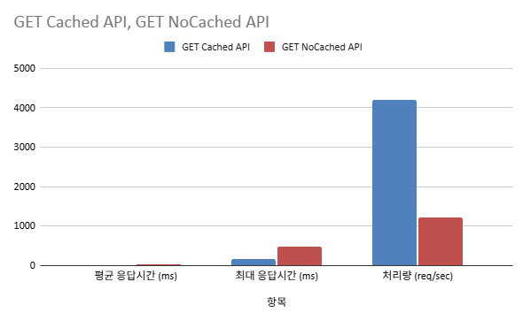
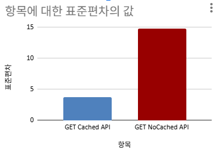

# Redis 캐싱 전략 적용 보고서

## 1. 캐싱 대상 구간 분석

### 대상 API: 인기 상품 조회 API (`GET /products/top-selling`)

### 기능 개요
- 최근 며칠 간의 판매 데이터를 기준으로 상위 인기 상품을 조회하는 API
- 사용자의 홈 화면 혹은 마케팅 페이지에서 자주 호출되는 성격의 API
- 다음 SQL 쿼리를 기반으로 집계 수행:

```sql
SELECT
    p.id AS product_id,
    p.name,
    SUM(oi.quantity) AS total_quantity_sold
FROM
    product p
JOIN
    order_item oi ON p.id = oi.product_id
JOIN
    orders o ON oi.order_id = o.id
WHERE
    o.order_date BETWEEN '2025-07-25' AND '2025-07-27 23:59:59'
GROUP BY
    p.id
ORDER BY
    total_quantity_sold DESC
LIMIT 3;
```

### 분석 결과
- **집계 연산 포함**: JOIN 및 SUM, GROUP BY 등의 집계 연산은 상대적으로 비용이 높은 쿼리임
- **자주 변하지 않음**: 인기 상품은 짧은 시간 내 자주 바뀌지 않으며, 통상적으로 하루 단위 또는 수 시간 단위로 집계 주기가 결정됨
- **다수 사용자에게 동일한 결과 제공**: 사용자마다 결과가 다르지 않음 → 공유 캐시 가능
- **변동 주기 명확함**: 캐시의 TTL(Time-To-Live)을 안정적으로 설정 가능 (예: 10분, 30분 등)

### 결론
> 인기 상품 조회 API는 캐시 전략 적용에 매우 적합한 구간으로 판단됨.

---

## 2. Redis 기반 캐싱 전략

### 적용 전략

| 항목 | 내용 |
|------|------|
| 캐시 저장소 | Redis |
| 키 구성 방식 | `topSelling:{기간}:limit:{N}` 형식 (예: `topSelling:3d:limit:3`) |
| TTL 설정 | 10분~30분 (조회 빈도와 비즈니스 요구사항에 따라 조정 가능) |
| 캐시 미스 시 처리 | DB 쿼리 수행 후 Redis에 저장 |
| 캐시 적중 시 처리 | Redis에서 바로 응답 반환 (DB 접근 없음) |

### 적용 방식 (Spring 기반 예시)
```java
@Cacheable(value = "topSelling", key = "'d3_L' + #limit", unless = "#result == null or #result.isEmpty()")
public List<ProductResponse> getTopSellingProducts(int limit) {
    // 위의 SQL 기반 데이터 조회
}
```

---

## 3. 성능 분석 결과 (JMeter 기반 테스트)

| 항목 | GET Cached API | GET NoCached API |
|------|----------------|------------------|
| 평균 응답시간 (ms) | **11 ms** | 40 ms |
| 최대 응답시간 (ms) | **157 ms** | 487 ms |
| 표준편차 | 3.7 | 14.77 |
| 처리량 (req/sec) | **4205.00** | 1226.55 |





### 분석 요약

- **평균 응답 시간 약 3.6배 개선**
- **최대 응답 시간 330ms 이상 단축**
- **처리량 약 3.4배 증가**
- 캐시 적용으로 인해 DB 부하가 현저히 감소, CPU 사용률 안정화

---

## 4. 결론 및 제안

- 인기 상품 조회 API는 성능 최적화를 위해 캐싱 전략을 적용하기에 적합한 대상임
- Redis 캐시 적용을 통해 응답시간 개선 및 처리량 증가 등 성능 최적화 효과가 확인됨
- 향후 비슷한 성격(집계, 반복 조회, 결과 공유)의 API에도 Redis 캐시 적용을 적극 검토할 수 있음
- TTL 및 Invalidation 전략(수동 삭제 또는 자동 만료) 역시 비즈니스 특성에 따라 유연하게 설정 필요